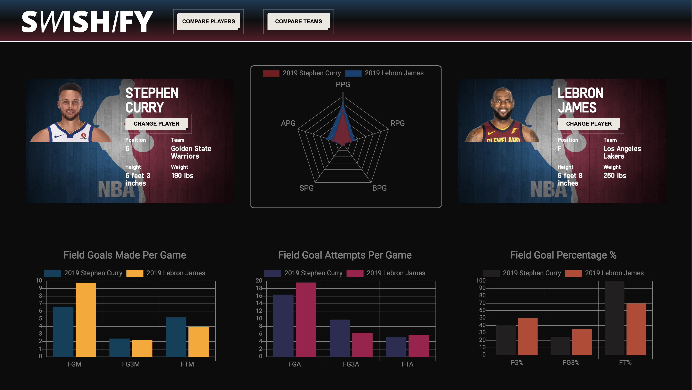
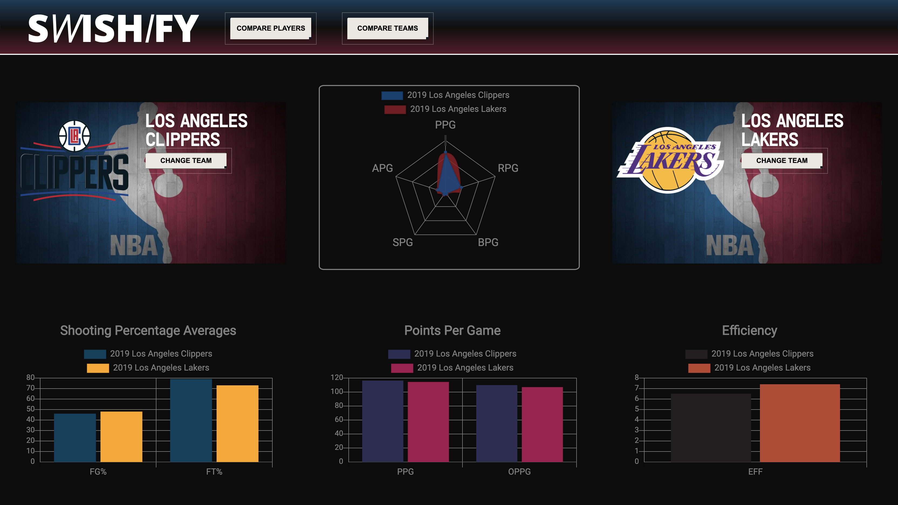

# Swishify - A Visual Basketball Statistics Comparison App
Because NBA basketball has been sorely missed during this COVID situation, and inspired by its anticipated return in July 2020, I decided to build a visual NBA app to compare player and team statistics. The mobile-responsive app utilizes several APIs to retrieve NBA stats data and are visually displayed on dynamic & responsive charts. The user can search for different teams and players across different seasons and compare them. The app was built using vanilla Javascript, HTML, CSS, chart.js, & jQuery.

The live site can be found at [https://brandonktran.github.io/Swishify-NBA_stat_visualization_comparison/](https://brandonktran.github.io/Swishify-NBA_stat_visualization_comparison/)

  

 
